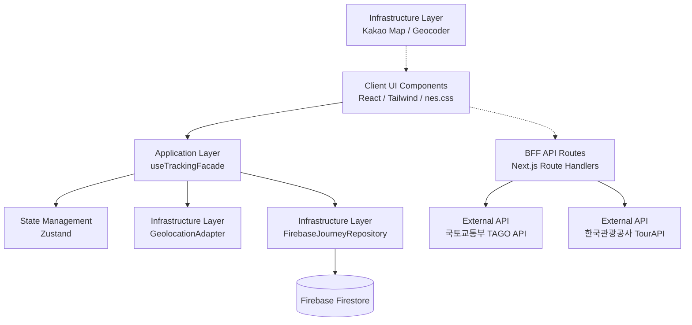

# 🗺️ Where Am I? (나만의 픽셀 모빌리티 다이어리)

> **"네비게이션이 아닌, 나의 이동 경로를 레트로 감성으로 기록하는 라이프로깅(Life-logging) 웹 애플리케이션"**


---

## 📖 1. 기획 배경 및 프로젝트 개요 (Motivation)
시중에는 훌륭한 길찾기(네비게이션) 앱들이 많지만, **"내가 오늘 어떤 경로로 돌아다녔지?"**를 감성적으로 기록해주는 '대중교통 특화 라이프로깅 앱'은 부족했습니다. 러닝이나 자전거 라이딩을 기록하는 'Strava(스트라바)'처럼, 대중교통과 도보를 이용한 일상적인 외출도 하나의 소중한 '여정(Journey)'으로 기록할 수 있다면 어떨까 하는 아이디어에서 출발했습니다.

여기에 8비트 레트로 픽셀 아트 감성(마인크래프트, 옛날 오락실 스타일)을 결합하여, 사용자가 앱을 켜고 이동하는 것 자체를 작은 게임처럼 즐길 수 있도록 기획했습니다.

<br/>

## ✨ 2. 핵심 기능 상세 (Key Features)

### 🏃 실시간 속도 기반 이동 수단 자동 추론 알고리즘
스마트폰의 HTML5 Geolocation API를 통해 1초 단위로 위경도 좌표를 수집합니다.
* **EMA(지수 이동 평균) 평활화:** 도심의 빌딩 숲에서 발생하는 GPS 튐(Bouncing) 현상을 방지하기 위해 노이즈 필터링 수학 알고리즘을 적용했습니다.
* **속도 임계값 기반 상태 전이:** 
  * `0 ~ 10km/h`: 도보 (🚶 초록색 점선 궤적)
  * `12 ~ 35km/h`: 간선/지선 버스 (🚌 파란색 실선 궤적)
  * `40km/h 이상`: 지하철/기차 (🚆 빨간색 실선 궤적)
* 사용자의 속도를 지속적으로 모니터링하여 이동 수단을 자동으로 변경하고, 지도 위에 수단별로 다른 색상의 다채로운 컬러 궤적을 실시간으로 렌더링합니다.

### 🚏 공공데이터 기반 정류장 '체크인(Check-in)' 시스템
* 자체 구축한 BFF 서버를 통해 **국토교통부 TAGO 버스 정보 API**와 통신하여, 내 주변 반경 500m 이내의 정류장을 지도에 픽셀 마커로 표시합니다.
* **전국 호환성 (Reverse Geocoding):** 카카오맵 API를 활용해 현재 위치의 위경도를 행정구역(시/도)으로 역변환한 뒤, 이를 국토교통부 고유의 `cityCode`로 자동 매핑합니다. 대전, 서울, 부산 등 **어디서든 앱 하나로 주변 버스 정보를 조회**할 수 있습니다.
* 정류장 마커를 클릭하면, 레트로 감성의 **'LED 전광판 바텀 시트'**가 올라오며 실제 버스들의 도착 예정 시간을 롤링 텍스트로 보여줍니다.
* 전광판의 `[📍 이곳에 기록]` 버튼을 누르면 마치 포스퀘어(Foursquare) 앱처럼 나의 여정 다이어리에 해당 정류장을 방문했음을 스탬프 찍듯 기록할 수 있습니다.

### 🔔 내 곁의 명소 알림 (Virtual Tour Guide)
* 이동 중 백그라운드에서 사용자의 위치 변화(2km 단위)를 감지합니다.
* **한국관광공사 TourAPI**와 연동하여, 주변의 숨겨진 명소나 유명 관광지를 탐색합니다.
* 조건에 맞는 명소가 발견되면, 레트로 픽셀 뉴스 속보(Ticker) 애니메이션과 함께 **"🔔 앗! 방금 'ㅇㅇ미술관' 근처를 지나셨네요!"**라는 깜짝 메시지를 띄워 일상 이동에 작은 즐거움을 더합니다.

### 🎟️ 여정 종료 및 레트로 영수증 티켓 (Journey Ticket) 발급
* 추적을 종료하면 지금까지의 여정을 모두 묶어 **감열식 종이 영수증(Thermal Receipt)** 형태의 예쁜 티켓 모달을 발급합니다.
* 영수증의 지그재그 절취선, 자체 렌더링된 바코드 아트, 발급 일시, 최고 도달 속도, 가장 많이 이용한 수단 등의 재미있는 통계 지표가 표시됩니다.

### 📚 나의 모험 기록 보관함 (Archive) 및 PWA 지원
* 발급된 티켓과 원본 궤적 데이터(수백 개의 위경도 포인트 배열)는 **Firebase Firestore Database**에 자동으로 압축 및 영구 저장됩니다.
* `/history` 페이지에서 언제든 과거의 여정들을 레트로 카드 형태로 열람하고, 총 이동 거리/시간 등 누적 통계를 확인할 수 있습니다.
* **PWA(Progressive Web App)**가 적용되어 스마트폰 홈 화면에 설치하고 네이티브 앱처럼 전체 화면으로 구동할 수 있습니다.

<br/>

## 🛠 3. 기술 스택 및 도입 배경 (Tech Stack & Justification)

| 기술 | 선택 이유 (Why?) |
| --- | --- |
| **Next.js 14** | SSR/SSG 이점 외에도, API Routes를 활용한 **BFF(Backend-For-Frontend)** 아키텍처를 단일 저장소(Monorepo)에서 빠르고 완벽하게 구현하기 위해 채택했습니다. |
| **TypeScript** | 도메인 모델(`Journey`, `RoutePoint`)을 엄격하게 타이핑하여 런타임 에러를 사전에 차단하고, 인터페이스 기반의 Adapter 패턴을 튼튼하게 설계하기 위해 필수적으로 사용했습니다. |
| **Zustand** | Redux 대비 보일러플레이트가 압도적으로 적으며, GPS의 빈번한 좌표 업데이트(1초에 1번 렌더링)에도 상태 동기화 및 렌더링 최적화가 용이하여 채택했습니다. |
| **Tailwind CSS & nes.css** | 빠른 UI 프로토타이핑을 위해 Tailwind를 사용했으며, 핵심적인 8비트 레트로 감성(도트 폰트, 말풍선, 버튼 등)을 살리기 위해 `nes.css` 프레임워크를 융합했습니다. |
| **Firebase Firestore** | 백엔드 인프라 구축에 소모되는 시간을 최소화하고, 프론트엔드 중심의 라이프로깅 데이터(거대한 위경도 배열)를 NoSQL Document 형태로 빠르고 유연하게 적재하기 위해 도입했습니다. |

<br/>

## 🏗 4. 트러블슈팅 및 아키텍처 (Troubleshooting & Architecture)

이 프로젝트는 토이 프로젝트의 스파게티 코드를 벗어나, **유지보수가 가능한 엔터프라이즈급 아키텍처**를 지향하며 아래의 문제들을 해결했습니다.

### 💡 트러블슈팅 1: 공공데이터 API CORS 에러 및 API 키 보안 이슈
* **문제:** 프론트엔드 환경에서 외부 공공데이터 API(TAGO)를 `fetch`로 직접 호출(Direct Call)하자 CORS 에러가 발생했고, 개발자 도구 네트워크 탭에 디코딩된 공공 API Key가 100% 노출되는 치명적인 보안 결함을 발견했습니다.
* **해결:** Next.js의 API Route를 미들웨어로 활용하는 **BFF 패턴**을 도입했습니다. 클라이언트는 우리 서버의 `/api/stations` 엔드포인트만 안전하게 호출하고, 서버 단에서 외부 API를 호출하여 키 유출과 CORS를 완벽히 차단했습니다. 추가로, 거대한 공공데이터 XML/JSON 응답을 클라이언트에 넘기기 전에 서버에서 프론트엔드 전용 모델(`TransportSchedule`)로 가볍게 정제하여 네트워크 페이로드를 대폭 절감했습니다.

### 💡 트러블슈팅 2: 비대해지는 Map 컴포넌트의 단일 책임 원칙(SRP) 위배
* **문제:** 초기에는 지도를 그리는 `MapComponent` 내부에 GPS 하드웨어 제어 로직, 속도 평활화 알고리즘, 그리고 상태 저장 로직이 모두 혼재되어 가독성이 떨어졌습니다.
* **해결:** 디자인 패턴 중 **Facade Pattern**과 **Adapter Pattern**을 적용한 **Clean Architecture(3-Tier)**로 리팩토링했습니다.
  * 브라우저 API 제어는 `infrastructure/GeolocationAdapter` 클래스로 격리.
  * 프론트엔드 UI 컴포넌트는 오직 `application/useTrackingFacade`의 `startTracking()` 함수만 호출하도록 은닉화(Encapsulation). 이를 통해 UI 로직은 오로지 '렌더링'에만 집중할 수 있게 되었습니다.

### 💡 트러블슈팅 3: 전국 호환을 위한 동적 시도 코드(cityCode) 맵핑
* **문제:** 공공데이터 버스 API는 지역별 고유 코드(`cityCode`)를 요구하는데, 사용자의 GPS 위경도만으로는 이 코드를 알 수 없어 특정 지역(대전)으로 코드를 하드코딩해야 하는 한계가 있었습니다.
* **해결:** Kakao Local API(Geocoder)를 도입하여, 사용자의 위경도를 한글 행정구역 주소로 실시간 역변환했습니다. 이 한글 문자열을 파싱하여 자체 구축한 `cityCodeMapper` 유틸리티를 거쳐 국토교통부 표준 코드로 매핑함으로써, 전국 어디서나 자동으로 해당 지역의 버스 정보를 불러오는 완벽한 호환성을 확보했습니다.

<br/>

## 🏗 5. 시스템 아키텍처 다이어그램 (System Architecture)

이 프로젝트는 확장성과 유지보수성을 극대화하기 위해 클린 아키텍처 사상을 차용하여 설계되었습니다.



<br/>

## 📂 6. 프로젝트 디렉토리 구조 (Clean Architecture 기반)

```text
src/
├── app/                  # Next.js App Router (Pages, BFF API Routes)
│   ├── api/              # BFF 계층 (transport, stations, tourism 라우터)
│   ├── history/          # 과거 여정 보관함 라우트
│   └── page.tsx          # 메인 UI 레이아웃
├── application/          # Application Layer (비즈니스 유스케이스)
│   ├── facades/          # useTrackingFacade (상태 및 API 제어 단일 창구)
│   ├── factories/        # TransportIconFactory (에셋 경로 분기 제어)
│   └── utils/            # cityCodeMapper (지오코딩 매퍼)
├── components/           # UI Components (MapComponent, JourneyTicket, TourismNewsTicker)
├── domain/               # Domain Layer (프레임워크 비의존 순수 모델)
│   ├── interfaces/       # 의존성 역전을 위한 포트 인터페이스
│   ├── queries/          # Firestore 쿼리 (fetchJourneys)
│   └── models/           # Journey, RoutePoint 엔티티 정의
├── infrastructure/       # Infrastructure Layer (외부 연동 구현체)
│   ├── adapters/         # GeolocationAdapter, TagoApiAdapter
│   └── repositories/     # FirebaseJourneyRepository (DB 구현체)
└── store/                # Zustand 상태 관리 스토어 (useLocationStore)
```

<br/>

## 🚀 7. 실행 방법 (Getting Started)

### 6.1 환경 변수 설정 (`.env.local`)
프로젝트 루트에 `.env.local` 파일을 생성하고 발급받은 키를 입력합니다.
```env
# Firebase Configuration
NEXT_PUBLIC_FIREBASE_API_KEY=your_api_key_here
NEXT_PUBLIC_FIREBASE_PROJECT_ID=your_project_id_here
# ... 기타 Firebase 설정 ...

# Kakao Map Configuration (카카오 디벨로퍼스 JavaScript 키)
NEXT_PUBLIC_KAKAO_MAP_API_KEY=your_kakao_map_api_key_here

# TAGO Open API Configuration (국토교통부 일반 인증키 - 디코딩)
TAGO_API_KEY=your_tago_api_key_here
```

### 6.2 패키지 설치 및 실행
```bash
# 의존성 설치
npm install
# 로컬 개발 서버 실행
npm run dev
```

> 💡 **심사/면접관을 위한 테스트 팁:** 이 앱은 100% 모바일 사용을 상정하고 설계되었습니다. 브라우저로 `localhost:3000`에 접속하신 후, **개발자 도구 (F12) -> 모바일 기기 시뮬레이터 모드 (Ctrl+Shift+M)** 로 전환하여 테스트하시면 실제 앱과 동일한 최적의 뷰를 경험하실 수 있습니다.
